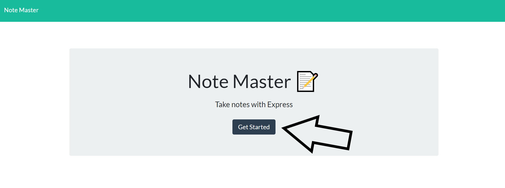

# Note Master

## Overview:
The Note Master provides a simple to use interface to both create and delete notes!  After a note is saved the note will be displayed on the screen as well as be sent to a JSON file so even after changing pages on the app the note will remain there until it is manually deleted.  This was primarily accomplished using an express server with get, post, and delete requests.    

### Table of Contents:
1. [How it works](#How-it-works)
2. [Example](#Example)
3. [Contributing](#Contributing)
4. [Questions](#Questions)
5. [License](#License)

### How it works!
Using the app is very easy!  Once you are greeted with the home page simply click the get started button and start creating notes.  Once a note is saved it will be displayed on the left side of the page.  If you want to delete a note click the garbage can attatched to it.

### Click Get Started Button
   
### Create a Note
   
### Delete a Note 
   

### Example
Here is a link to the Note Master:  [https://vfavorito-note-master.herokuapp.com/](https://vfavorito-note-master.herokuapp.com/)

### Contributing
If you would like to contribute to the development of this app the guidelines for doing so can be found here: [Contribution Covenant](https://www.contributor-covenant.org/version/2/0/code_of_conduct/code_of_conduct.txt)

### Questions?
Visit my Github profile here: [vfavorito](https://github.com/vfavorito) 
If you have any questions you can reach out to me at vince.favorito@gmail.com

### License
This App is covered under the MIT License